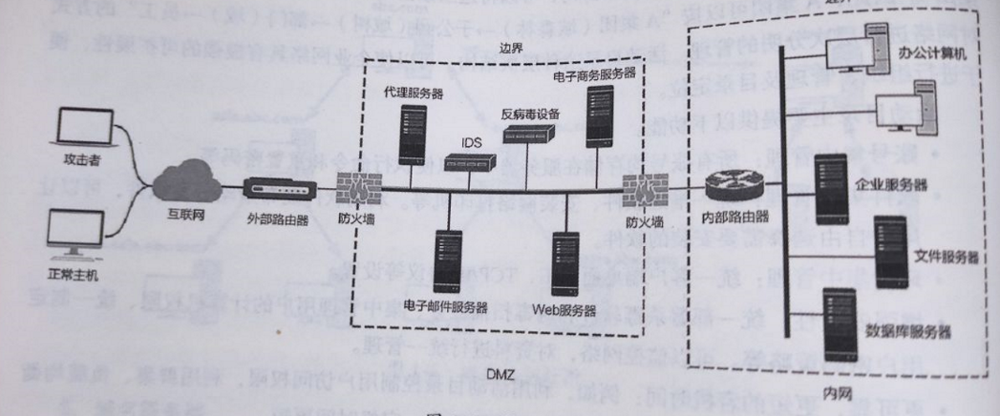
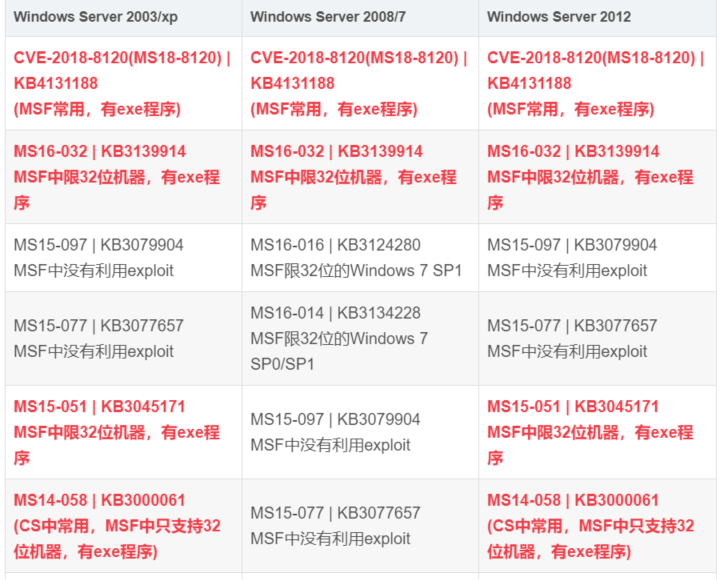

# 内网渗透

> 靶机，使用红日的靶机就行
>
> https://blog.51cto.com/Jach1n/5291370 搭建环境 
>
> 《内网安全攻防》
>
> https://xie1997.blog.csdn.net/

- 当渗透测试到达后渗透阶段时，我们拿到了位于公网主机的权限，并且通过该主机挂代理能够访问位于内网的机器。这时如果客户有内网渗透的需求，那么我们就要开始进行内网渗透了。、



DMZ区：

- demilitarized zone区称为隔离区，是为了解决安装防火墙后外部网络不能访问内部网络服务器的问题而设立的一个非安全系统与安全系统之间的缓冲区。
- **DMZ位于企业内部网络和外部网络之间**。可以在DMZ中放置一些必须公开的服务器设施，例如企业Wb服务器、FTP服务器和论坛服务器等。
- **DMZ是对外提供服务的区域，因此可以从外部访问。**
- 在网络边界上一般会部署防火墙及入侵检测、入侵防御产品等。如果有Wb应用，还会设置WAF,从而更加有效地保护内网。攻击者如果要进入内网，首先要突破的就是这重重防御。

在配置一个拥有DMZ区的网络时，通常需要定义如下访问控制策略，以实现其屏障功能。

- 内网可以访问外网：内网用户需要自由地访问外网。在这一策略中，防火墙需要执行NAT.
- 内网可以访问DMZ:此策略使内网用户可以使用或者管理DMZ中的服务器。
- **外网不能访问内网**：这是防火墙的基本策略。内网中存储的是公司内部数据，显然，这些数据一般是不允许外网用户访问的(如果要访问，就要通过VPN的方式来进行)。
- 外网可以访问DMZ:因为DMZ中的服务器需要为外界提供服务，所以外网必须可以访问DMZ。同时，需要由防火墙来完成从对外地址到服务器实际地址的转换。
- **DMZ不能访问内网**：如果不执行此策略，当攻击者攻陷DMZ时，内网将无法受到保护。
- DMZ不能访问外网：此策略也有例外。例如，在DMZ中放置了邮件服务器，就要允许访问外网，否则邮件服务器无法正常工作。

## 内网信息收集

### **内网信息收集概述**

**我是谁、我在哪、我要去哪⾥。有什么权限，目标在哪。**

  - 对当前机器进行判断，是哪种功能的服务器
  - 对当前机器所处网络环境的拓扑结构进行分析和判断
  - 对当前机器所处区域进行判断，是dmz，办公区还是核心区。

**信息收集：**

  -  网段，ip，主机名
  -  端口开放情况：MYSQL，SQLserver，Oracle，Redis，Elasticsearch，MongoDB
  -  内网web：OA，邮箱，shiro，门户等。
  -  集权系统定位：
    -  域控
    -  vcenter
    -  esxi
    -  天擎服务器
    -  深信服EDR
    - 堡垒机

**那么，内网渗透该如何开始呢？内网渗透分为域环境渗透和非域环境渗透。**

### **如何查看当前主机是否处在域环境中？**

- **执行 `net time /domain` 查询**

    - 非域环境：直接找不到控制器

        - ```bash
            C:\Users\lambo>net time /domain
            找不到域 WORKGROUP 的域控制器。
            
            请键入 NET HELPMSG 3913 以获得更多的帮助。
            ```

    - 域环境本地用户查询，显示拒绝访问，

        - 
        - 本地普通用户只能查询本机相关信息。无法查看域内信息
        
    - 域环境域用户查询，查询成功
    
    - ```
        C:\Users\liukaifeng01>net time /domain
        owa.god.org的当前时间是2022/9/410:10:12
        命令成功完成。
        ```

    - 域环境本地管理员用户：

        - 域内除了普通域用户和域管理员账户之外，还有一个机器用户，这个用户也是域内用户可以执行域命令。
        - 而机器用户，是域内每一台机器的system权限所代表的用户，用户名称为机器名加上$，所以使用本机的system权限就可以运行域内的查询命令了。
        - administrator可以直接提升为system权限

- **执行 ipconfig /all 查询** 

    - 普通环境的主DNS后缀是空，**域环境查询的主DNS后缀是域名**

        ```bash
        C:\Users\lambo> ipconfig /all
        
        Windows IP 配置
        
           主机名  . . . . . . . . . . . . . : lambo
           主 DNS 后缀 . . . . . . . . . . . :                             这里为空，表示不在域内
           节点类型  . . . . . . . . . . . . : 混合
           IP 路由已启用 . . . . . . . . . . : 否
           WINS 代理已启用 . . . . . . . . . : 否
           DNS 后缀搜索列表  . . . . . . . . : .....
        ```

- **执行 systeminfo 查询** 

    - 普通环境 `systeminfo` 查询的域是 WORKGROUP，域环境查询的域是域名

    - ```bash
        Windows 目录:     C:\WINDOWS
        系统目录:         C:\WINDOWS\system32
        ...........
        域:               WORKGROUP
        ```

- **net config workstation**

    - **查询当前登陆域及登陆用户信息**

    - 工作站域DNS名称：表示当前是否在域环境中，**如果显示WORKGROUP表示为非域环境，域环境会显示域名**
	
	- 登陆域：用于表示当前登陆的用户是域用户还是本地用户，如果是本地用户会显示域名，域用户会显示账户名
	
	- ```bash
	    C:\Users\lambo>net config workstation
	    计算机名                     \\LAMBO
	    计算机全名                   lambo
	    用户名                       xxxxxxxxxxx
	    工作站正运行于
	            xxxxxxxxxxxxxxxxxxxxxxxxxx
	    软件版本                     Windows 10 Pro
	    工作站域                     WORKGROUP
	    登录域                       MicrosoftAccount
	    ```

### 非域环境渗透思路

- 背景：当我们通过代理进入内网，并且通过信息收集已经得知当前处于非域环境下。

- 思路：
  - 先对本机进行提权：如果该主机不能提权至 管理员/root 权限的话，则我们要尽可能多的搜集该主机上的信息，然后对内网其他主机进行攻击，拿下另外的主机作为突破口。
  - 然后信息收集本机上各种信息(各种服务的账号密码以及其他的敏感信息)。
  - 再探测内网网段划分，内网存活主机，开放的端口及服务
  - 内网中存在的弱口令比较多，对探测到的服务进行弱口令暴力破解
  - 对于探测到的内网Web服务器，除了检测弱口令外，还可以尝试常见的Web漏洞。
  - 对于Windows主机，还可以尝试MS17_010、CVE-2019-0708之类的漏洞。


## **端口转发/代理**

我们不能直接访问内网，需要拿下的服务器做流量数据的转发，或者服务器的一些端口不对外开放，只能本机访问，这个时候就需要端口转发/代理。

### 几个概念：

- 端口转发：有时被叫做隧道
    - 端口转发，**数据包是被直接转发了，还是换上了服务器的ip？**
    - 本地端口转发：
        - **就是将靶机公网网卡的一个端口绑定靶机的公网网网卡的一个端口。是同一个网卡不同端口**
        - **适用于靶机的某个端口只能由内网ip连接**
            - 比如服务器3389端口不对外开放，我们可以发送数据到服务器的12345端口，然后服务器做本地端口转发，把12345端口得到的数据包发送到3389端口。
        - **对于本地端口转发，如果是Window机器的话：lcx，netsh**
        - **linux机器：lcx，ssh，iptables。**
    - 远程端口转发：
        - **远程端口转发是将靶机一个端口绑定内网中任意机器的一个端口，也可以是公网网卡绑定内网网卡。**
        - 适用于我们无法访问内网机器
    
- 代理（隧道）：
    - **代理能以靶机ip转发攻击机任意数据**
    - 目标服务器开启代理服务（安装个软件，启动服务），本地使用代理软件，比如proxychains。
    - 如果目标机器不出网，则可以使用HTTP代理，如     reGeorg 或 New-reGeorg：[reGeorg结合proxychains代理链(HTTP隧道)](https://xie1997.blog.csdn.net/article/details/84568266#reGeorg代理)
- 端口复用：
    - 比如服务器开启的80端口是web服务，我们可以复用80端口，在服务器上添加其他的服务，两个服务的数据互不干扰。

### 内网转发工具

**实现分类：**

- 按照协议进行分类，可以分为：Socks协议 和 Socket协议 
    - socks协议：协议工作在OSI参考模型的第5层(会话层)，使用TCP协议传输数据，因而不提供如传递 ICMP信息之类的网络层网关服务。
    - socket协议：工作在传输层。
- 按照工具工作原理分类，可以分为：  端口转发类 和 web代理类
- 按照目标是否出网或者出网协议，可以分为：HTTP隧道、DNS隧道、ICMP隧道等
    - 

#### Frp

一般用于一层代理，即我们的数据通过靶机端口转发进入内网。

#### nps:

#### ew：

#### reGeorg(HTTP隧道)

#### pystinger(毒刺）

#### 系统自带，ssh iptables netsh做代理

#### Netsh实现端口转发：

#### LCX实现端口转发：

### 情况和思路

**当我们通过Web渗透拿到了一台Web服务器的Webshell(菜刀/蚁剑/冰蝎)后，我们接下来有几个需求。**

- 第一：**拿到了该主机的账号密码，想远程3389连到这台主机(Windows)或者SSH连接这台主机(Linux)。**
    - 大多数情况下，3389端口或者22端口，亦或是其他端口，虽然开着，但是并不对外开放
    - **本地端口转发**
    - **代理**
    - **复用该主机开放的端口，**比如80端口，将80端口接受到的流量自动转给3389或22端口。传送门——>[端口复用](https://blog.csdn.net/qq_36119192/article/details/104435223)
- **第二：获得了内网中其他主机的权限，账号，密码。想让公网能直接3389或SSH连接这台主机。、**
    - 代理
    - 远程端口转发
- **第三：由于Webshell的流量特征很明显，并且容易被发现，所以想利用加密的或者基于TCP/ICMP的远控**
    - 冰蝎：这是动态二进制加密的远控
    - MSF：传送门——> [Msfvenonm生成后门木马](https://blog.csdn.net/qq_36119192/article/details/83869141)
    - CobaltStrike：
    - [使用ICMP进行命令控制(Icmpsh)](https://blog.csdn.net/qq_36119192/article/details/100036500)
    - [使用DNS进行命令控制(DNS-Shell)](https://blog.csdn.net/qq_36119192/article/details/92695913)
    - [使用DNS进行命令控制(dnscat2)](https://blog.csdn.net/qq_36119192/article/details/104429983)
- **第四：想利用该Web服务器作为跳板，搭建一个代理隧道，进入内网，对内网继续进行渗透测试。**
    - **如果该主机只允许80/443端口往外出流量**，这样的话，我们就必须得使用HTTP隧道了，传送门——> [reGeorg结合proxychains代理链(HTTP隧道)](https://blog.csdn.net/qq_36119192/article/details/84568266#reGeorg代理)
- **第五：想利用该Web服务器作为跳板（这个web服务器应该是横向移动得到的，80端口不会出外网），搭建一个代理隧道，进入内网，但是由于该机器禁止TCP UDP的流量出去，所以只能利用ICMP和DNS协议出去，因为这两个协议基本上不会被禁止的**

## **内网环境及主机存活探测：**

当前机器到底能通多少网段

### 利用arp协议探测

先查看一下 arp中缓存的主机

arp-scan.exe 

- 就是发送arp数据包，收集活跃主机的ip地址和mac地址信息。

- `arp -t 192.168.1.0/24`

Invoke-ARPScan.ps1、

Empire的arpscan模块、

- empire内置了arpscan模块。
- 使用命令`usemodule situational_awareness/network/arpscan`

NiShang的Invoke-ARPScan.ps1脚本

### 利用NetBIOS快速探测内网

NetBIOS是局域网程序使用的一种应用程序编程接口(API),为程序提供了请求低级别服务的统一的命令集，为局域网提供了网络及其他特殊功能。几乎所有的局域网都是在NetBIOS协议的基础上工作的。

NetBIOS也是计算机的标识名，主要用于局域网中计算机的互访。

**NetBIOS的工作流程就是正常的机器名解析查询应答过程，**因此推荐优先使用。

**nbtscan**是一个命令行工具，用于扫描本地或远程TCP/IP网络上的开放NetBIOS名称服务器。

**nbtscan有Windows和Linux两个版本**，体积很小，不需要安装特殊的库或DLL就能使用。

NetBIOS的使用方法比较简单。将其上传到目标主机中，然后直接输入IP地址范围并运行，

**即适合域内探测，也适合普通内网探测**

### 利用icmp协议ping批量探测

> https://mp.weixin.qq.com/s/15RcEYN_GvDLI92aX95qTw

- 可以先测试一个**arp**中查看到的ip，看防火墙有没有过滤ping

- ```shell
    #windows
    for /L %I in (1,1,254) Do @ping -w 1 -n 1 192.168.52.%I | findstr "TTL="
    #linux：
    for k in $( seq 1 255);do ping -c 1 192.168.7.$k|grep "ttl"|awk -F "[ :]+" '{print $4}'; done
    fping命令 linux下
    ```

- 探测内网网段

    ```bash
    #linux
    for t in {0..255}do  ping -c 1 -w 1 192.168.$t.1 | grep "ttl=" >/dev/null 2>&1 || ping -c 1 -w 1 192.168.$t.254 | grep "ttl=" >/dev/null 2>&1  if [ $? -eq 0 ];then    echo 192.168.$t.0/24 is alive ! >> aliveHost.txt  else    echo 192.168.$t.0/24 May be sleeping !  fidone
    ```

### msf的内网主机探测（存活，端口，服务):

- 可以先搭建好代理，然后proxychains msfconsole 启动MSF，这样，我们的MSF就可以探测内网主机了。

```
存活探测：
auxiliary/scanner/discovery/udp_sweep #基于udp协议发现内网存活主机
auxiliary/scanner/discovery/udp_probe #基于udp协议发现内网存活主机
auxiliary/scanner/netbios/nbname #基于netbios协议发现内网存活主机
auxiliary/scanner/portscan/tcp #基于tcp进行端口扫描(1-10000)，如果开放了端口，则说明该主机存活
```

## **内网主机端口扫描及服务探测：** 

### 代理之后nmap

### 脚本

PowerSploit框架的invoke-portscan.ps1脚本、Nishang的Invoke-PortScan模块

### msf

```
• 端口扫描：
auxiliary/scanner/portscan/tcp #基于tcp进行端口扫描(1-10000)
auxiliary/scanner/portscan/ack #基于tcp的ack回复进行端口扫描，默认扫描1-10000端口
• 服务扫描：
auxiliary/scanner/ftp/ftp_version #发现内网ftp服务，基于默认21端口
auxiliary/scanner/ssh/ssh_version #发现内网ssh服务，基于默认22端口
auxiliary/scanner/telnet/telnet_version #发现内网telnet服务，基于默认23端口
auxiliary/scanner/dns/dns_amp #发现dns服务，基于默认53端口
auxiliary/scanner/http/http_version #发现内网http服务，基于默认80端口
auxiliary/scanner/http/title #探测内网http服务的标题
auxiliary/scanner/smb/smb_version #发现内网smb服务，基于默认的445端口
use auxiliary/scanner/mssql/mssql_schemadump #发现内网SQLServer服务,基于默认的1433端口
use auxiliary/scanner/oracle/oracle_hashdump #发现内网oracle服务,基于默认的1521端口
auxiliary/scanner/mysql/mysql_version #发现内网mysql服务，基于默认3306端口
auxiliary/scanner/rdp/rdp_scanner #发现内网RDP服务，基于默认3389端口
auxiliary/scanner/redis/redis_server #发现内网Redis服务，基于默认6379端口
auxiliary/scanner/db2/db2_version #探测内网的db2服务，基于默认的50000端口
auxiliary/scanner/netbios/nbname #探测内网主机的netbios名字
```

### scanLine

ScanLine是一款经典的端口扫描工具，可以在所有版本的Windows操作系统中使用，体积小，仅使用单个文件，同时支持TCP/UDP端口扫描

## 内网横向渗透

**我们通过代理，将数据通过代理转发到内网，同时我们只能正向连接内网机器，因为内网的机器不知道们攻击机的ip，但是我们可以通过代理，正向连接到内网机器。**

常用漏洞：

- 

- 实战中最常用的本地溢出提权有 CVE-2018-8120、MS16-032、MS15-051 和 MS14-058 。在MSF中，最常用的提权模块是CVE-2018-8120；在CobaltStrike中，最常用的提权模块的是 MS14-058。这四个提权，都有对应的exe程序。exe程序均支持32和64位的机器。

### **远程连接：(密码或者hash)**

### 内网挂代理打ms17010：

### MS08-067：

### CVE-2019-0708

### **哈希传递攻击(PtH)**

### 内网web服务器漏洞挖掘

## 内网渗透会遇到的一些问题

### 如何跨网段-多层隔离：

如网闸，DMZ隔离。找能跨网段的机器，如集权系统，运维机器。

### 内网目标服务器不出网怎么办？

## 内网攻击手法

### 哈希传递攻击(PtH)

**有管理员密码hash但是解不出密码**

哈希传递攻击是基于NTLM认证的一种攻击方式。哈希传递攻击的利用前提是**我们获得了某个用户的密码哈希值，但是解不开明文**。这时我们可以利用NTLM认证的一种缺陷，利用用户的密码哈希值来进行NTLM认证。

**在工作组环境中，可能存在一些机器本地管理员账号密码相同**，这时我们就可以使用这台机器上得到的管理员hash去远程登陆其他机器了。

**在域环境中，域用户可以登陆任意一台主机，所有同样可以使用哈希传递攻击。但是只能是域管理员组内用户(可以是域管理员组内非administrator用户)的哈希值才能进行哈希传递攻击，攻击成功后，可以访问域内任何一台机器。**


## linux内网安全建议

- 台服务器上安装waf或者云盾，监控并拦截木马程序的运行

- 监控服务器上开启的新端口，查看其连接情况，是否有异常连接

- 服务器及时更新补丁

- 服务器上运行的应用给予低权限

