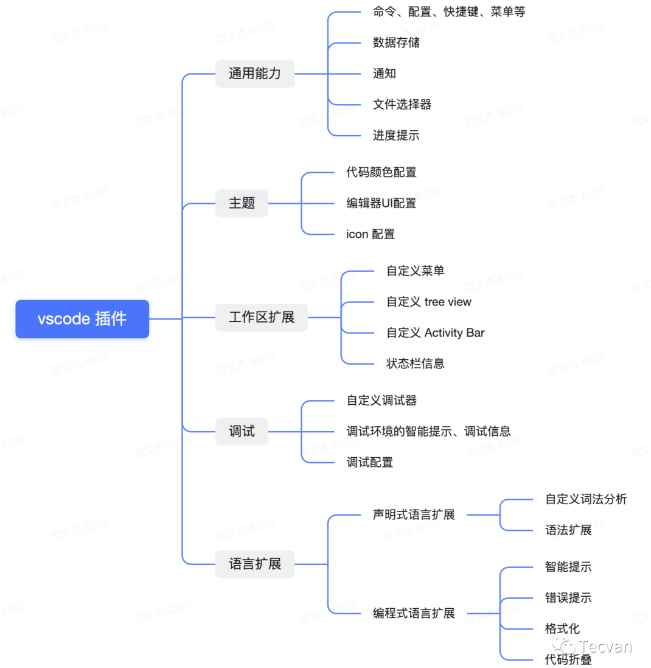
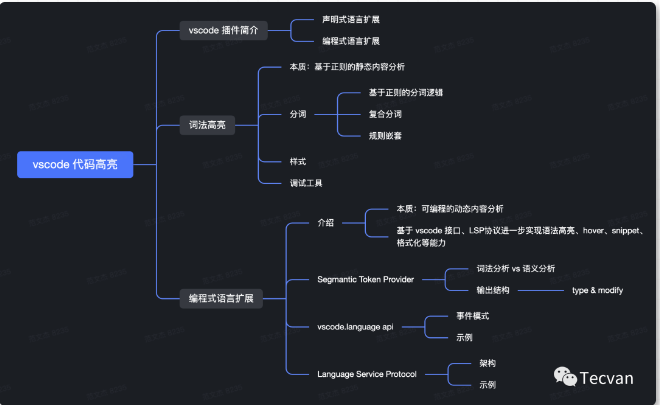
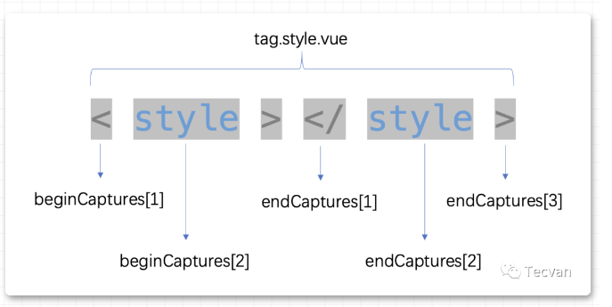
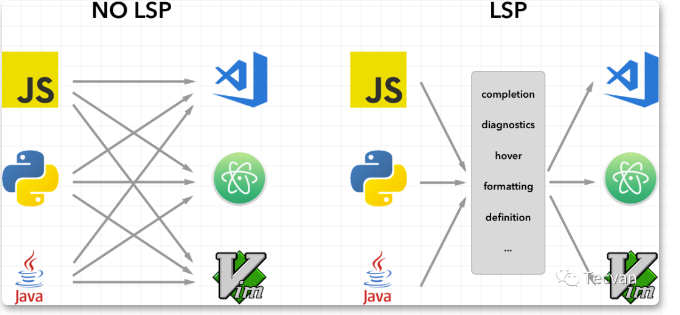
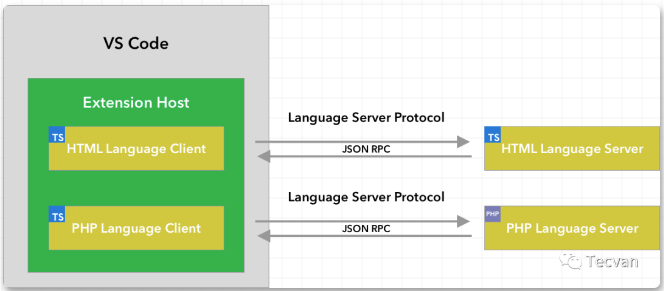

## 前端技术发展

html

css

css 预处理器：

- less
- sass

javascript:

- 原生 js 开发：按照 ECMAScript 标准的开发方式，简称 ES

Typescript ：微软的标准：

js 框架：

- jqurery: 简化 dom 操作。
- angular
- react
- **vue：**
  - 计算属性--虚拟化 DOM
  - MVVM+虚拟 DOM
- Axio：前端通信模型，类似 AJAX，因为 Vue 的边界很明确，就是为了处理 DOM，并不具备通信能力，所以使用 Axio，也可以使用 AJAX，vue 推荐使用 Axio。

UI 框架：

- Bootstrap:twitter 推出的一个用于前端开发的开源工具包
- **ElementUI**，iview，Ice 基于 vue 的 UI 框架。

javascript 构建工具

- Babel
- WebPack：模块打包工具，主要作用就是打包，压缩，合并以及按序加载。

后端技术 Nodejs：

大前端模式：

- MVVM

## JavaScript

> https://zh.javascript.info/

### 模块

- `export` 关键字标记了可以从当前模块外部访问的变量和函数。
- `import` 关键字允许从其他模块导入功能。

**模块只通过 HTTP(s) 工作，而非本地**

如果你尝试通过 `file://` 协议在本地打开一个网页，你会发现 `import/export` 指令不起作用。你可以使用本地 Web 服务器，例如 [static-server](https://www.npmjs.com/package/static-server#getting-started)，或者使用编辑器的“实时服务器”功能，例如 VS Code 的 [Live Server Extension](https://marketplace.visualstudio.com/items?itemName=ritwickdey.LiveServer) 来测试模块。

换句话说，对于模块，我们使用导入/导出而不是依赖全局变量。

如果同一个模块被导入到多个其他位置，那么它的代码只会执行一次，即在第一次被导入时。然后将其导出（export）的内容提供给进一步的导入（importer）。

这里有一条规则：顶层模块代码应该用于初始化，创建模块特定的内部数据结构。如果我们需要多次调用某些东西 —— 我们应该将其以函数的形式导出，就像我们在上面使用 `sayHi` 那样。

### 基础

#### 变量：

- let 用来声明变量，以前我们是用 var 来声明变量的。

- var 和 let 的区别：

  - 现代脚本中一般不再使用 var。

  - “var” 没有块级作用域

    - 用 `var` 声明的变量，不是函数作用域就是全局作用域。它们在代码块外也是可见的（译注：也就是说，`var` 声明的变量只有函数作用域和全局作用域，没有块级作用域）。

  - 举个例子：

    ```javascript
    if (true) {
      var test = true; // 使用 "var" 而不是 "let"
    }

    alert(test); // true，变量在 if 结束后仍存在
    ```

    由于 `var` 会忽略代码块，因此我们有了一个全局变量 `test`。

    如果我们在第二行使用 `let test` 而不是 `var test`，那么该变量将仅在 `if` 内部可见：

    ```javascript
    if (true) {
      let test = true; // 使用 "let"
    }

    alert(test); // ReferenceError: test is not defined
    ```

    对于循环也是这样的，`var` 声明的变量没有块级作用域也没有循环局部作用域：

    ```javascript
    for (var i = 0; i < 10; i++) {
      var one = 1;
      // ...
    }

    alert(i); // 10，"i" 在循环结束后仍可见，它是一个全局变量
    alert(one); // 1，"one" 在循环结束后仍可见，它是一个全局变量
    ```

    如果一个代码块位于函数内部，那么 `var` 声明的变量的作用域将为函数作用域：

    ```javascript
    function sayHi() {
      if (true) {
        var phrase = "Hello";
      }

      alert(phrase); // 能正常工作
    }

    sayHi();
    alert(phrase); // ReferenceError: phrase is not defined
    ```

    可以看到，`var` 穿透了 `if`，`for` 和其它代码块。这是因为在早期的 JavaScript 中，块没有词法环境，而 `var` 就是这个时期的代表之一。

  - **var 允许重新声明**

  - **“var” 声明的变量，可以在其声明语句前被使用**

    - 当函数开始的时候，就会处理 `var` 声明（脚本启动对应全局变量）。
    - 换言之，`var` 声明的变量会在函数开头被定义，与它在代码中定义的位置无关（这里不考虑定义在嵌套函数中的情况）。

#### 常量：`const`

## TypeScript

### tsconfig.json 简介

> 了不起的 tsconfig.json 指南 - 王平安的文章 - 知乎 https://zhuanlan.zhihu.com/p/145210784

## Jquery

jquery 使用了简化 dom 操作的一个 js 库，不仅简化了你获取 DOM 的方式，而且还给你在里面增加了无数个直接操作 DOM 的方法，而且还给你增加了针对 JS 对象的方法和 AJAX 的相关的简化封装。

早期前端都是通过 jQuery 来实现页面数据的绑定和交互操作，因为那时候前端生态还是处于很匮乏的时代，等 angular vue react 出来的时候已经百花齐放了， vue 是通过 Vue 对象将数据和视图分离，通过数据来驱动视图变化；

| jQuery                                                  | Vue                              |
| ------------------------------------------------------- | -------------------------------- |
| jQuery 直接可以操作 DOM                                 | Vue 不直接操作 dom，采用虚拟 dom |
| jquery 通过选择器选取元素，进行取值赋值、事件绑定等操作 | Vue 通过数据驱动界面             |

jQuery 只是对 JS API 的一种封装，让你写 JS 代码量减少的一个工具库。

Vue 则是更上层封装的一门框架，其中借鉴了 MVVM 的架构，使用它完全可以抛开 JS 中对 DOM 的操作。

**AJAX**

## VUE

mvvm

## npm/yarn

### npm

> https://chinese.freecodecamp.org/news/what-is-npm-a-node-package-manager-tutorial-for-beginners/

npm（“Node 包管理器”）是 JavaScript 运行时 Node.js 的默认程序包管理器。类似 python 的 pip。

在程序开发中我们常常需要依赖别人提供的框架，写 JS 也不例外。这些可以重复的框架代码被称作包（package）或者模块（module），一个包可以是一个文件夹里放着几个文件，同时有一个叫做 package.json 的文件。

- npm 由三个独立的部分组成：
  - 网站
  - 注册表（registry）
  - 命令行工具 (CLI)
- [_网站_](https://npmjs.com/) 是开发者查找包（package）、设置参数以及管理 npm 使用体验的主要途径。
- _注册表_ 是一个巨大的数据库，保存了每个包（package）的信息。
- [_CLI_](https://docs.npmjs.com/cli/npm) 通过命令行或终端运行。开发者通过 CLI 与 npm 打交道。

#### npm 安装

npm 是依附于 node.js 的，我们可以去它的官网 https://nodejs.org/en/download/ 下载安装 node.js。

```
npm -v    查看npm版本
npm install npm@latest -g   升级最新的npm版本
			<packageName>@<version> 也可以下载其他版本
```

#### package.json

每个 JavaScript 项目（无论是 Node.js 还是浏览器应用程序）都可以被当作 npm 软件包，并且通过 `package.json` 来描述项目和软件包信息。我们可以将 `package.json` 视为快递盒子上的运输信息。

**package.json**

使用 `npm init` 即可在当前目录创建一个 `package.json` 文件：

文件内的内容(基本元数据)由开发人员提供：

- `name`：JavaScript 项目或库的名称。
- `version`：项目的版本。通常，在应用程序开发中，由于没有必要对开源库进行版本控制，因此经常忽略这一块。但是，仍可以用它来定义版本。
- `description`：项目的描述。
- `license`：项目的许可证。
- 1.`dependencies`：在生产环境中需要用到的依赖 2.`devDependencies`：在开发、测试环境中用到的依赖
  - 开发依赖是仅用于开发的程序包，在生产环境中并不需要。 例如测试的软件包、webpack 或 Babel。

**package-lock.json**

该文件描述了 npm JavaScript 项目中使用的依赖项的确切版本。如果 `package.json` 是通用的描述性标签，则 `package-lock.json` 是成分表。

就像我们通常不会读取食品包装袋上的成分表（除非你太无聊或需要知道）一样，`package-lock.json` 并不会被开发人员一行一行进行读取.

#### 用户如何使用 NPM

**npm install**

这是现在我们开发 JavaScript/Node.js 应用程序时最常用的命令。

默认情况下，`npm install` 默认会安装`package.json` 中 `dependencies` 和 `devDependencies` 里的所有模块。

npm 项目上下文中的 `npm install` 将根据 `package.json` 规范将软件包下载到项目的 `node_modules` 文件夹中，从而升级软件包的版本（并重新生成 `package-lock.json` ）。

`npm install <package-name>` 可以基于 `^` 和 `〜` 版本匹配。

如果要在全局上下文中安装程序包，可以在机器的任何地方使用它，则可以指定全局标志 `-g`（例如 [live-server](https://github.com/tapio/live-server)）。

如果想只安装 `dependencies` 中的内容，可以使用 `--production` 字段：`npm install --production`不应该将 `devDependencies` 引入生产环境！

**npm ci**

因此，如果 `npm install --production` 对于生产环境是最佳选项，那么是否必须有一个对本地环境，测试环境最合适的选项？

答案是 `npm ci`。

就像如果 `package_lock.json` 尚不存在于项目中一样，无论何时调用 `npm install` 都会生成它，`npm ci` 会消耗该文件来下载项目所依赖的每个软件包的确切版本。

这样，无论是用于本地开发的笔记本电脑还是 Github Actions 等 CI（持续集成）构建环境，我们都可以确保项目上下文在不同机器上保持完全相同。

**npm run serve 启动网站**

**[nvm](https://github.com/coreybutler/nvm-windows) 用来切换不同的 nodejs 版本**

例如，需要安装 v6.9.1 版本的 Node.js，那可以通过以下命令完成。

nvm 换源

我们可以找到 nvm-windows 软件的安装目录中的 `settings.txt` 文件，增加以下内容:

```awk
node_mirror=http://npm.taobao.org/mirrors/node/
```

通过 nvm 可以同时安装多个版本的 Node.js，我们可以指定某个版本的使用。

```apache
nvm install v8.17.0   #安装
nvm use v8.17.0			#使用
```

查看当前安装的 Node.js 版本列表

```bash
nvm ls
```

### yarn

#### yarn 介绍

Yarn 是 Facebook, Google, Exponent 和 Tilde 开发的一款新的 JavaScript 包管理工具。

Yarn 是为了弥补 npm 的一些缺陷而出现的。

这句话让我想起了使用 npm 时的坑了：
\- `npm install`的时候**巨慢**。特别是新的项目拉下来要等半天，删除 node_modules，重新 install 的时候依旧如此。
\- 同一个项目，安装的时候**无法保持一致性**。由于 package.json 文件中版本号的特点，下面三个版本号在安装的时候代表不同的含义。

```shell
"5.0.3",
"~5.0.3",
"^5.0.3"
“5.0.3”表示安装指定的5.0.3版本，“～5.0.3”表示安装5.0.X中最新的版本，“^5.0.3”表示安装5.X.X中最新的版本。
```

**Yarn 的优点？**

- **速度快** 。速度快主要来自以下两个方面：

1. 并行安装：无论 npm 还是 Yarn 在执行包的安装时，都会执行一系列任务。npm 是按照队列执行每个 package，也就是说必须要等到当前 package 安装完成之后，才能继续后面的安装。而 Yarn 是同步执行所有任务，提高了性能。
2. **离线模式**：如果之前已经安装过一个软件包，用 Yarn 再次安装时之间从缓存中获取，就不用像 npm 那样再从网络下载了。

- 安装**版本统一**：为了防止拉取到不同的版本，Yarn 有一个锁定文件 (lock file) 记录了被确切安装上的模块的版本号。每次只要新增了一个模块，Yarn 就会创建（或更新）yarn.lock 这个文件。这么做就保证了，每一次拉取同一个项目依赖时，使用的都是一样的模块版本。npm 其实也有办法实现处处使用相同版本的 packages，但需要开发者执行 npm shrinkwrap 命令。这个命令将会生成一个锁定文件，在执行 npm install 的时候，该锁定文件会先被读取，和 Yarn 读取 yarn.lock 文件一个道理。npm 和 Yarn 两者的不同之处在于，Yarn 默认会生成这样的锁定文件，而 npm 要通过 shrinkwrap 命令生成 npm-shrinkwrap.json 文件，只有当这个文件存在的时候，packages 版本信息才会被记录和更新。

- **更简洁的输出**：npm 的输出信息比较冗长。在执行 npm install 的时候，命令行里会不断地打印出所有被安装上的依赖。相比之下，Yarn 简洁太多：默认情况下，结合了 emoji 直观且直接地打印出必要的信息，也提供了一些命令供开发者查询额外的安装信息。

- **多注册来源处理：**所有的依赖包，不管他被不同的库间接关联引用多少次，安装这个包时，只会从一个注册来源去装，要么是 npm 要么是 bower, 防止出现混乱不一致。

- **更好的语义化**： yarn 改变了一些 npm 命令的名称，比如 yarn add/remove，感觉上比 npm 原本的 install/uninstall 要更清晰。

- **Yarn 和 npm 命令对比**

  ```text
  npm install === yarn
  npm install taco --save === yarn add taco
  npm uninstall taco --save === yarn remove taco
  npm install taco --save-dev === yarn add taco --dev
  npm update --save === yarn upgrade
  npm run serve   === yarn run serve
  yarn安装全局包的命令是yarn global add 【包名】
  
  查看 yarn 全局包的可执行文件安装位置：yarn global bin
  
  查看 yarn 全局包的源文件安装位置：yarn global dir
  
  修改 yarn 全局包 bin 安装位置：yarn config set global-folder "你的磁盘路径"
  
  修改环境变量：export PATH=$PATH:【yarn 全局包 bin 安装位置】
  
  改变 yarn 缓存位置：yarn config set cache-folder "你的磁盘路径"
  ```

#### yarn 安装

```shell
windows: winget install yarn 或者直接下载msi文件
跨平台： npm install --gobal yarn

```

安装后检查：`yarn --version`

```shell
安装yrm：yrm 不仅可以快速切换镜像源，还可以测试自己网络访问不同源的速度
npm install -g yrm
yrm ls 列出当前可用的所有镜像源
    (base) PS C:\Users\lambo> yrm ls
      npm ---- https://registry.npmjs.org/
      cnpm --- http://r.cnpmjs.org/
    * taobao - https://registry.npm.taobao.org/
      nj ----- https://registry.nodejitsu.com/
      rednpm - http://registry.mirror.cqupt.edu.cn/
      npmMirror  https://skimdb.npmjs.com/registry/
      edunpm - http://registry.enpmjs.org/
      yarn --- https://registry.yarnpkg.com
使用淘宝镜像源：yrm use taobao
测试访问速度：yrm test taobao
```

#### 创建项目

```shell
yarn init   初始化一个项目，类似于git init,填写下项目详情就行。

就会在对应目录生成一个package.json文件
```

添加依赖包：

```shell
yarn add [package]
yarn add [package]@[version]
yarn add [package]@[tag]
```

**将依赖项添加到不同依赖项类别中**:

```shell
分别添加到 devDependencies、peerDependencies 和 optionalDependencies 类别中：

yarn add [package] --dev
yarn add [package] --peer
yarn add [package] --optional

升级依赖包:
yarn upgrade [package]
yarn upgrade [package]@[version]
yarn upgrade [package]@[tag]
```

**移除依赖包**：`yarn remove [package]：`

**安装项目的全部依赖**：`yarn或者 yarn install`

## Electron

> Electron 是一个使用 JavaScript、HTML 和 CSS 构建桌面应用程序的框架。 嵌入 [Chromium](https://www.chromium.org/) 和 [Node.js](https://nodejs.org/) 到 二进制的 Electron 允许您保持一个 JavaScript 代码代码库并创建 在 Windows 上运行的跨平台应用 macOS 和 Linux——不需要本地开发 经验。
>
> 参考：https://www.electronjs.org/zh/docs/latest/tutorial/
>
>  Eletron 实战

### 一个简单的 Electron 项目

安装 nodejs，安装 npm。

**注意** 因为 Electron 将 Node.js 嵌入到其二进制文件中，你应用运行时的 Node.js 版本与你系统中运行的 Node.js 版本无关。

创建 Electron 项目：

```
yarn init
默认会生成一个package.json，记得入口点改为main.js,默认是index.js
author 与 description 可为任意值，但对于应用打包是必填项。

package.json

{
  "name": "test",
  "version": "1.0.0",
  "description": "test",
  "main": "main.js",
  "author": "lambo",
  "license": "MIT"
}
```

然后，将 `electron` 包安装到应用的开发依赖中。

`yarn add --dev electron`

在您的 [`package.json`](https://docs.npmjs.com/cli/v7/using-npm/scripts)配置文件中的`scripts`字段下增加一条`start`命令：

```
{
  "scripts": {
    "start": "electron ."
  }
}
```

`start`命令能让您在开发模式下打开您的应用`yarn start`

运行主进程

任何 Electron 应用程序的入口都是 `main` 文件。 这个文件控制了**主进程**，它运行在一个完整的 Node.js 环境中，负责控制您应用的生命周期，显示原生界面，执行特殊操作并管理渲染器进程。

创建页面

写个普通的 html 页面。 在 Electron 中，各个窗口显示的内容可以是本地 HTML 文件，也可以是一个远程 url。

```html
<!DOCTYPE html>
<html>
  <head>
    <meta charset="UTF-8" />
    <!-- https://developer.mozilla.org/en-US/docs/Web/HTTP/CSP -->
    <meta
      http-equiv="Content-Security-Policy"
      content="default-src 'self'; script-src 'self'"
    />
    <title>Hello World!</title>
  </head>
  <body>
    <h1>Hello World!</h1>
    We are using Node.js <span id="node-version"></span>, Chromium
    <span id="chrome-version"></span>, and Electron
    <span id="electron-version"></span>.
  </body>
</html>
```

在窗口中打开我们写的页面

现在您有了一个页面，将它加载进应用窗口中。 要做到这一点，你需要 两个 Electron 模块：

- [`app`](https://www.electronjs.org/zh/docs/latest/api/app) 模块，它控制应用程序的事件生命周期。
- [`BrowserWindow`](https://www.electronjs.org/zh/docs/latest/api/browser-window) 模块，它创建和管理应用程序 窗口。

因为主进程运行着 Node.js，您可以在 main.js 文件头部将它们导入作为 [CommonJS](https://nodejs.org/docs/latest/api/modules.html#modules_modules_commonjs_modules) 模块：

```javascript
const { app, BrowserWindow } = require("electron");
```

然后，添加一个`createWindow()`方法来将`index.html`加载进一个新的`BrowserWindow`实例。

```javascript
const createWindow = () => {
  const win = new BrowserWindow({
    width: 800,
    height: 600,
  });

  win.loadFile("index.html");
};
```

接着，调用`createWindow()`函数来打开您的窗口。

在 Electron 中，只有在 `app` 模块的 [`ready`](https://www.electronjs.org/zh/docs/latest/api/app#event-ready) 事件被激发后才能创建浏览器窗口。 您可以通过使用 [`app.whenReady()`](https://www.electronjs.org/zh/docs/latest/api/app#appwhenready) API 来监听此事件。 在`whenReady()`成功后调用`createWindow()`。

```javascript
app.whenReady().then(() => {
  createWindow();
});
```

注意：此时，您的电子应用程序应当成功 打开显示您页面的窗口！

`yarn run make`生成程序

Electron-forge 会创建 `out` 文件夹，您的软件包将在那里找到：

```
// Example for macOS
out/
├── out/make/zip/darwin/x64/my-electron-app-darwin-x64-1.0.0.zip
├── ...
└── out/my-electron-app-darwin-x64/my-electron-app.app/Contents/MacOS/my-electron-app
```

### 引入 vue

创建 Vue 项目之前我们需要先安装 Vue CLI。它是一个命令行工具，可以辅助开发人员创建 Vue 项目，安装指令如下：

```shell
yarn global add @vue/cli
```

创建一个 vue 项目

```
 vue create demo
```

Vue CLI Plugin Electron Builder 是能将 Vue 引入 Electron 项目的工具。安装 Vue 插件 electron-builder（也就是 Vue CLI Plugin Electron Builder）

```
vue add electron-builder
```

安装完成后通过如下指令启动程序：

```
yarn electron:serve
```


项目目录结构如下所示：

```
project/
├─ src/
├ ├ background.js
├ └─ main.js
├ dist_electron
└─ public/
```

dist_electron 目录存放应用打包后的安装程序。
public 目录存放项目的静态资源，此目录下的程序不会被 webpack 处理。
src/background.js 是主进程入口程序。
src/main.js 是渲染进程入口程序。

## vscode 插件开发

> https://liiked.github.io/VS-Code-Extension-Doc-ZH/#/
>
> https://www.cnblogs.com/liuxianan/p/vscode-plugin-overview.html
>
> https://code.visualstudio.com/api 官方文档

vscode 是使用 Electron 技术。vscode 插件可以使用 TypeScript 来编写（官方推荐），也可以使用 JavaScript。

与 Webpack 相似，vscode 本身只是实现了一套架子，架子内部的命令、样式、状态、调试等功能都以插件形式提供，vscode 对外提供了五种拓展能力：



### 安装脚手架

```cmd
npm install -g yo generator-code
#然后创建一个项目
yo code
```

### package

- 配置扩展激活卸载的事件，入口文件路径。
- 添加右键菜单和快捷键

```json
//常用设置
{
  // 插件的名字，应全部小写，不能有空格
  "name": "vscode-plugin-demo",
  // 插件的友好显示名称，用于显示在应用市场，支持中文
  "displayName": "VSCode插件demo",
  // 描述
  "description": "VSCode插件demo集锦",
  // 关键字，用于应用市场搜索
  "keywords": ["vscode", "plugin", "demo"],
  // 版本号
  "version": "1.0.0",
  // 发布者，如果要发布到应用市场的话，这个名字必须与发布者一致
  "publisher": "sxei",
  // 表示插件最低支持的vscode版本
  "engines": {
    "vscode": "^1.27.0"
  },
  // 插件应用市场分类，可选值： [Programming Languages, Snippets, Linters, Themes, Debuggers, Formatters, Keymaps, SCM Providers, Other, Extension Packs, Language Packs]
  "categories": ["Other"],
  // 插件图标，至少128x128像素
  "icon": "images/icon.png",
  // 扩展的激活事件数组，可以被哪些事件激活扩展，后文有详细介绍
  "activationEvents": ["onCommand:extension.sayHello"],
  // 插件的主入口
  "main": "./src/extension",
  // 贡献点，整个插件最重要最多的配置项
  "contributes": {
    // 插件配置项
    "configuration": {
      "type": "object",
      // 配置项标题，会显示在vscode的设置页
      "title": "vscode-plugin-demo",
      "properties": {
        // 这里我随便写了2个设置，配置你的昵称
        "vscodePluginDemo.yourName": {
          "type": "string",
          "default": "guest",
          "description": "你的名字"
        },
        // 是否在启动时显示提示
        "vscodePluginDemo.showTip": {
          "type": "boolean",
          "default": true,
          "description": "是否在每次启动时显示欢迎提示！"
        }
      }
    },
    // 命令
    "commands": [
      {
        "command": "extension.sayHello",
        "title": "Hello World"
      }
    ],
    // 快捷键绑定
    "keybindings": [
      {
        "command": "extension.sayHello",
        "key": "ctrl+f10",
        "mac": "cmd+f10",
        "when": "editorTextFocus"
      }
    ],
    // 菜单
    "menus": {
      // 编辑器右键菜单
      "editor/context": [
        {
          // 表示只有编辑器具有焦点时才会在菜单中出现
          "when": "editorFocus",
          "command": "extension.sayHello",
          // navigation是一个永远置顶的分组，后面的@6是人工进行组内排序
          "group": "navigation@6"
        },
        {
          "when": "editorFocus",
          "command": "extension.demo.getCurrentFilePath",
          "group": "navigation@5"
        },
        {
          // 只有编辑器具有焦点，并且打开的是JS文件才会出现
          "when": "editorFocus && resourceLangId == javascript",
          "command": "extension.demo.testMenuShow",
          "group": "z_commands"
        },
        {
          "command": "extension.demo.openWebview",
          "group": "navigation"
        }
      ],
      // 编辑器右上角图标，不配置图片就显示文字
      "editor/title": [
        {
          "when": "editorFocus && resourceLangId == javascript",
          "command": "extension.demo.testMenuShow",
          "group": "navigation"
        }
      ],
      // 编辑器标题右键菜单
      "editor/title/context": [
        {
          "when": "resourceLangId == javascript",
          "command": "extension.demo.testMenuShow",
          "group": "navigation"
        }
      ],
      // 资源管理器右键菜单
      "explorer/context": [
        {
          "command": "extension.demo.getCurrentFilePath",
          "group": "navigation"
        },
        {
          "command": "extension.demo.openWebview",
          "group": "navigation"
        }
      ]
    },
    // 代码片段
    "snippets": [
      {
        "language": "javascript",
        "path": "./snippets/javascript.json"
      },
      {
        "language": "html",
        "path": "./snippets/html.json"
      }
    ],
    // 自定义新的activitybar图标，也就是左侧侧边栏大的图标
    "viewsContainers": {
      "activitybar": [
        {
          "id": "beautifulGirl",
          "title": "美女",
          "icon": "images/beautifulGirl.svg"
        }
      ]
    },
    // 自定义侧边栏内view的实现
    "views": {
      // 和 viewsContainers 的id对应
      "beautifulGirl": [
        {
          "id": "beautifulGirl1",
          "name": "国内美女"
        },
        {
          "id": "beautifulGirl2",
          "name": "国外美女"
        },
        {
          "id": "beautifulGirl3",
          "name": "人妖"
        }
      ]
    },
    // 图标主题
    "iconThemes": [
      {
        "id": "testIconTheme",
        "label": "测试图标主题",
        "path": "./theme/icon-theme.json"
      }
    ]
  },
  // 同 npm scripts
  "scripts": {
    "postinstall": "node ./node_modules/vscode/bin/install",
    "test": "node ./node_modules/vscode/bin/test"
  },
  // 开发依赖
  "devDependencies": {
    "typescript": "^2.6.1",
    "vscode": "^1.1.6",
    "eslint": "^4.11.0",
    "@types/node": "^7.0.43",
    "@types/mocha": "^2.2.42"
  },
  // 后面这几个应该不用介绍了
  "license": "SEE LICENSE IN LICENSE.txt",
  "bugs": {
    "url": "https://github.com/sxei/vscode-plugin-demo/issues"
  },
  "repository": {
    "type": "git",
    "url": "https://github.com/sxei/vscode-plugin-demo"
  },
  // 主页
  "homepage": "https://github.com/sxei/vscode-plugin-demo/blob/master/README.md"
}
```

### contributes

```
configuration：设置
commands：命令
menus：菜单
keybindings：快捷键绑定
languages：新语言支持
debuggers：调试
breakpoints：断点
grammars
themes：主题
snippets：代码片段
jsonValidation：自定义JSON校验
views：左侧侧边栏视图
viewsContainers：自定义activitybar
problemMatchers
problemPatterns
taskDefinitions
colors
```

### 语言扩展

> https://mp.weixin.qq.com/s/4TNh0sTyT49Flxs2sdr0uw

#### 介绍

Vscode 的代码高亮、代码补齐、错误诊断、跳转定义等语言功能由两种扩展方案协同实现，包括：

- 基于词法分析技术，识别分词 token 并应用高亮样式
- 基于可编程语言特性接口，识别代码语义并应用高亮样式，此外还能实现错误诊断、智能提示、格式化等功能

两种方案的功能范畴逐级递增，相应地技术复杂度与实现成本也逐级升高，本文将概要介绍两种方案的工作过程与特点，各自完成什么工作，互相这么写作，并结合实际案例一步步揭开 vscode 代码高亮功能的实现原理：



其中，代码高亮功能由 **「语言扩展」** 类插件实现，根据实现方式又可以细分为：

- **「声明式」** ：以特定 JSON 结构声明一堆匹配词法的正则，无需编写逻辑代码即可添加如块级匹配、自动缩进、语法高亮等语言特性，vscode 内置的 extendsions/css、extendsions/html 等插件都是基于声明式接口实现的
- **「编程式」** ：vscode 运行过程中会监听用户行为，在特定行为发生后触发事件回调，编程式语言扩展需要监听这些事件，动态分析文本内容并按特定格式返回代码信息

声明式性能高，能力弱；编程式性能低，能力强。**语言插件开发者通常可以混用，用声明式接口在最短时间内识别出词法 token，提供基本的语法高亮功能；之后用编程式接口动态分析内容，提供更高级特性比如错误诊断、智能提示等。**

Vscode 中的**声明式语言扩展基于 TextMate 词法分析引擎实现**；

**编程式语言扩展**则基于语义分析接口、`vscode.language.*` 接口、Language Server Protocol 协议三种方式实现，下面展开介绍每种技术方案的基本逻辑。

#### 调试工具

- Vscode 内置了一套 scope inspect 工具，用于调试 TextMate 检测出的 token、scope 信息，使用时只需要将编辑器光标 focus 到特定 token 上，快捷键 `ctrl + shift + p` 打开 vscode 命令面板后输出 `Developer: Inspect Editor Tokens and Scopes` 命令并回车：
  - 命令运行后就可以看到分词 token 的语言、scope、样式等信息。
  - 给插件安装后的查看。
- 实时调试：
  -

#### 新语言支持：languages

```json
"contributes": {
    "languages": [
                {
                    //新语言的名字
                    "id": "cna",
                    //新语言的别名
                    "aliases": [
                        "Aggressor Script",
                        "cna"
                    ],
                    //新语言的后缀名
                    "extensions": [
                        ".cna"
                    ],
                    //新语言的配置文件路径
                    "configuration": "./language-configuration.json"
                }
            ],
}
```

**注意**：如果你的语言配置文件以**`language-configuration.json`**结尾，那么 VS Code 会帮你添加代码补全和校验功能。

**以下均为 language-configuration.json 文件设置**

##### 启用/关闭注释

- VS Code 提供了切换注释的命令：

  - **Toggle Line Comment**
  - **Toggle Block Comment**

- 分别来配置`comments.lineComment`控制块注释和`comments.blockComment`控制行注释。

  - ```
      {
      	"comments": {
      		"lineComment": "//",
      		"blockComment": ["/*", "*/"]
      	}
      }
    ```

##### 定义括号

- 你在 VS Code 中将鼠标移动到一个括号边上时，VS Code 会自动高亮对应的括号。

  ```json
  {
    "brackets": [
      ["{", "}"],
      ["[", "]"],
      ["(", ")"]
    ]
  }
  ```

- 另外，当你运行**Go to Bracket**或**Select to Bracket**时，VS Code 会自动使用你的定义找到最近、最匹配的括号。

##### 自动闭合符号

- 当你输入一个字符的时候时，VS Code 会自动帮你补全另一个单引号然后将光标放在引号中间，我们来看看是怎么做的：

- ```json
  {
    "autoClosingPairs": [
      { "open": "{", "close": "}" },
      { "open": "[", "close": "]" },
      { "open": "(", "close": ")" },
      { "open": "'", "close": "'", "notIn": ["string", "comment"] },
      { "open": "\"", "close": "\"", "notIn": ["string"] },
      { "open": "`", "close": "`", "notIn": ["string", "comment"] },
      { "open": "/**", "close": " */", "notIn": ["string"] }
    ]
  }
  ```

##### 自动环绕符号

- 当你选择了一堆文本然后输入左括号时，VS Code 会对选中内容外围加上对应的括号。这个功能叫做*自动环绕符号*，你可以参考下面的代码指定这项功能：

- ```
    {
    	"surroundingPairs": [
    		["{", "}"],
    		["[", "]"],
    		["(", ")"],
    		["'", "'"],
    		["\"", "\""],
    		["`", "`"]
    	]
    }
  ```

- 注意用户可以通过`editor.autoSurround`设置*自动环绕符号*的行为。

##### 代码折叠

- 在 VS Code 中有三种代码折叠类型：
- **缩进折叠：这是 VS Code 中默认的缩进行为，当两行内容有着相同的缩进级别时，你就可以看到折叠标记了。**
- 语言配置折叠：当 VS Code 发现`folding.markers`同时定义了`start`和`end`时，对应区域内就会出现折叠标记。下述配置会对`//#region`和`//#endregionJSON`区域创建代码折叠标记：

##### 单词匹配

##### 缩进规则

#### 代码片段：snippets

代码片段，也叫`snippets`，相信大家都不陌生，就是输入一个很简单的单词然后一回车带出来很多代码。平时大家也可以直接在 vscode 中创建属于自己的`snippets`：

```json
"contributes": {
    "snippets": [
		{
			// 代码片段作用于那种语言
			"language": "javascript",
			// 片段文件路径
			"path": "./snippets/test.json"
    	}
	]
}
```

比如创建一个 for 循环，输入 for 就快速生成代码片段

```json
//./snippets/test.json

{
    "for循环": {
        "prefix": "for",
        "body": [
          "for (const ${2:item} of ${1:array}) {",
          "\t$0",
          "}"
        ],
        "description": "for循环"
    }
}


for循环：snippets的名字；
prefix：输入什么单词触发代码片段；
body：一个数组，存放代码片段的内容，每一行一个字符串；
description：片段的描述；
${1:xxx}占位符，数字表示光标聚焦的顺序，1表示默认光标落在这里，按下回车或者tab跳到2的位置，以此类推，xxx表示此位置的默认值，可省略，比如直接写$3；$0最后一个聚焦的位置

```

```
//为加深印象我们再来一个ajax的例子：
{
	"ajax": {
        "prefix": "ajax",
        "body": [
            "$.ajax({",
            "    url: '$1',",
            "    method: '${2:POST}',",
            "    datatype: 'json',",
            "    success: data => {",
            "        $3;",
            "    },",
            "    error: err => {",
            "        $4;",
            "    }",
            "})"
        ],
        "description": "ajax模块"
    }
}

```

#### 语法高亮：grammars

语法高亮决定源代码的颜色和样式，它主要负责关键字（如 javascript 中的`if`，`for`）、字符串、注释、变量名等等语法的着色工作。

语法高亮由两部分工作组成：

##### 分词：将文本分割为一系列符号（包括单词和标点）

- Vscode 的词法分析基于 TextMate 引擎实现，功能比较复杂，可以简单划分为三个方面：基于正则的分词、复合分词规则、嵌套分词规则。

  - ```
      {
          "patterns": [
              {
                  "name": "keyword.control",
                  "match": "\b(if|while|for|return)\b"
              }
          ]
      }
    ```

  - 示例中，`patterns` 用于定义规则集合， `match` 属性定于用于匹配 token 的正则，`name` 属性声明该 token 的分类(scope)

  - TextMate 分词过程遇到匹配 `match` 正则的内容时，会将其看作单独 token 处理并分类为 `name` 声明的 `keyword.control` 类型。

  - 上述示例会将 `if/while/for/return` 关键词识别为 `keyword.control` 类型，但无法识别其它关键字：

    - 

  - 在 TextMate 语境中，scope 是一种 `.` 分割的层级结构，例如 `keyword` 与 `keyword.control` 形成父子层级，这种层级结构在样式处理逻辑中能实现一种类似 css 选择器的匹配，后面会讲到细节。

- 复合分词：

  - 上述示例配置对象在 TextMate 语境下被称作 Language Rule，除了 `match` 用于匹配单行内容，还可以使用 `begin + end` 属性对匹配更复杂的跨行场景。从 `begin` 到 `end` 所识别到的范围内，都认为是 `name` 类型的 token，比如在 vuejs/vetur 插件的 `syntaxes/vue.tmLanguage.json` 文件中有这么一段配置：

  - ```json
    {
      "name": "Vue",
      "scopeName": "source.vue",
      "patterns": [
        {
          "begin": "(<)(style)(?![^/>]*/>\\s*$)",
          // 虚构字段，方便解释
          "name": "tag.style.vue",
          "beginCaptures": {
            "1": {
              "name": "punctuation.definition.tag.begin.html"
            },
            "2": {
              "name": "entity.name.tag.style.html"
            }
          },
          "end": "(</)(style)(>)",
          "endCaptures": {
            "1": {
              "name": "punctuation.definition.tag.begin.html"
            },
            "2": {
              "name": "entity.name.tag.style.html"
            },
            "3": {
              "name": "punctuation.definition.tag.end.html"
            }
          }
        }
      ]
    }
    ```

  - 配置中，`begin` 用于匹配 `<style>` 语句，`end` 用于匹配 `</style>` 语句，且 `<style></style>` 整个语句被赋予 scope 为 `tag.style.vue` 。此外，语句中字符被 `beginCaptures` 、`endCaptures` 属性分配成不同的 scope 类型：

    - 

  - 这里从 `begin` 到 `beginCaptures` ，从 `end` 到 `endCaptures` 形成了某种程度的复合结构，从而实现一次匹配多行内容。

- 规则嵌套：

  - 在上述 `begin + end` 基础上，TextMate 还支持以子 `patterns` 方式定义嵌套的语言规则，例如：

  - ```json
    {
      "name": "lng",
      "patterns": [
        {
          "begin": "^lng`",
          "end": "`",
          "name": "tecvan.lng.outline",
          "patterns": [
            {
              "match": "tec",
              "name": "tecvan.lng.prefix"
            },
            {
              "match": "van",
              "name": "tecvan.lng.name"
            }
          ]
        }
      ],
      "scopeName": "tecvan"
    }
    ```

  - 配置识别 lng\` 到 \` 之间的字符串，并分类为 `tecvan.lng.outline` 。之后，递归处理两者之间的内容并按照子 `patterns` 规则匹配出更具体的 token ，例如对于：

    - ```
        lng`awesome tecvan`
      ```

  - 可识别出分词：

    - lng\`awesome tecvan\` ，scope 为 `tecvan.lng.outline`
    - `tec` ，scope 为 `tecvan.lng.prefix`
    - `van` ，scope 为 `tecvan.lng.name`

  - TextMate 还支持语言级别的嵌套，例如：

    - ```
        {
            "name": "lng",
            "patterns": [
                {
                    "begin": "^lng`",
                    "end": "`",
                    "name": "tecvan.lng.outline",
                    "contentName": "source.js"
                }
            ],
            "scopeName": "tecvan"
        }
      ```

    - 基于上述配置， lng\`到 \` 之间的内容都会识别为 `contentName` 指定的 `source.js` 语句。

##### 样式：然后根据主题或用户设置，对符号进行着色添加样式

- 词法高亮本质上就是先按上述规则将原始文本拆解成多个具类的 token 序列，之后按照 token 的类型适配不同的样式。TextMate 在分词基础上提供了一套按照 token 类型字段 scope 配置样式的功能结构，例如：

  - ```
      {
          "tokenColors": [
              {
                  "scope": "tecvan",
                  "settings": {
                      "foreground": "#eee"
                  }
              },
              {
                  "scope": "tecvan.lng.prefix",
                  "settings": {
                      "foreground": "#F44747"
                  }
              },
              {
                  "scope": "tecvan.lng.name",
                  "settings": {
                      "foreground": "#007acc",
                  }
              }
          ]
      }
    ```

- 示例中，`scope` 属性支持一种被称作 **「Scope Selectors」** 的匹配模式，这种模式与 css 选择器类似，支持：

  - 元素选择，例如 `scope = tecvan.lng.prefix` 能够匹配 `tecvan.lng.prefix` 类型的 token；特别的 `scope = tecvan` 能够匹配 `tecvan.lng` 、`tecvan.lng.prefix` 等子类型的 token
  - 后代选择，例如 `scope = text.html source.js` 用于匹配 html 文档中的 JavaScript 代码
  - 分组选择，例如 `scope = string, comment` 用于匹配字符串或备注

- 插件开发者可以自定义 scope 也可以选择复用 TextMate 内置的许多 scope ，包括 comment、constant、entity、invalid、keyword 等，完整列表请查阅 官网。

- `settings` 属性则用于设置该 token 的表现样式，支持 foreground、background、bold、italic、underline 等样式属性。

#### 编程语言扩展：

- 词法分析引擎 TextMate 本质上是一种基于正则的静态词法分析器，优点是接入方式标准化，成本低且运行效率较高，缺点是静态代码分析很难实现某些上下文相关的 IDE 功能，例如对于下面的代码：
- 注意代码第一行函数参数 `languageModes` 与第二行函数体内的 `languageModes` 是同一实体但是没有实现相同的样式，视觉上没有形成联动。
  - 
- 为此，vscode 在 TextMate 引擎之外提供了三种更强大也更复杂的语言特性扩展机制：
  - 使用 `DocumentSemanticTokensProvider` 实现可编程的语义分析
  - 使用 `vscode.languages.*` 下的接口监听各类编程行为事件，在特定时间节点实现语义分析
  - **根据 Language Server Protocol 协议实现一套完备的语言特性分析服务器**
- **相比于上面介绍的声明式的词法高亮，语言特性接口更灵活，能够实现诸如错误诊断、候选词、智能提示、定义跳转等高级功能。**

### Language Server Protocol

- 上述基于语言扩展插件的代码高亮方法有一个相似的问题：难以在编辑器间复用，同一个语言，需要根据编辑器环境、语言重复编写功能相似的支持插件，那么对于 n 种语言，m 种编辑器，这里面的开发成本就是 `n * m`。
- 为了解决这个问题，微软提出了一种叫做 Language Server Protocol 的标准协议，语言功能插件与编辑器之间不再直接通讯，而是通过 LSP 做一层隔离：
  - 

#### lsp 介绍

- LSP —— Language Server Protocol 本质上是一种基于 JSON-RPC 的进程间通讯协议，LSP 本身包含两大块内容：

  - 定义 client 与 server 之间的通讯模型，也就是谁、在什么时候、以什么方式向对方发送什么格式的信息，接收方又以什么方式返回响应信息

  - 定义通讯信息体，也就是以什么格式、什么字段、什么样的值表达信息状态
- 作为类比，HTTP 协议专门用于描述网络节点间如何传输、理解超媒体文档的网络通讯协议；而 LSP 协议则专门用于描述 IDE 中，用户行为与响应之间的通讯方式与信息结构。
- 总结一下，LSP 架构的工作流程如下：

  - 编辑器如 VSCode 跟踪、计算、管理用户行为模型，在发生某些特定的行为序列时，以 LSP 协议规定的通讯方式向 Language Server 发送动作与上下文参数

  - Language Server 根据这些参数异步地返回响应信息

  - 编辑器再根据响应信息处理交互反馈
- 
- 简单说，编辑器负责与用户直接交互， Language Server 负责在背后默默计算如何响应用户的交互动作，两者以进程粒度分离、解耦，在 LSP 协议框架下各司其职又协作共生。就好像我们通常开发的 Web 应用中，前端负责与用户交互，服务端负责管理诸如权限、业务数据、业务状态流转等不可见的部分。
- 目前，LSP 协议已经发展到 3.16 版本，覆盖大多数语言特性，包括：
  - 代码补全
  - 代码高亮
  - 定义跳转
  - 类型推断
  - 错误检测
  - 等等
- **得益于 LSP 清晰的设计，这些语言特性的开发套路都很相似，学习曲线很平滑，开发的时候基本上只需要关心监听那个函数，返回什么格式的结构，可以说掌握几个示例之后就可以很简单地上手了。**
- 过去，IDE 对语言特性的支持是集成在 IDE 或者以同构插件形式实现的，在 VSCode 中这种同构扩展能力以 **「Language API」** 或 **「Sematic Tokens Provider」** 接口方式提供，这两种方式在上一篇文章《[你不知道的 VSCode 代码高亮原理](https://link.zhihu.com/?target=https%3A//mp.weixin.qq.com/s/4TNh0sTyT49Flxs2sdr0uw)》都有过介绍了，虽然架构上比较简单，容易理解，但有一些明显硬伤：
  - 插件开发者必须复用 VSCode 本身的开发语言、环境，例如 Python 语言插件就必须用 JavaScript 写
  - 同一个编程语言需要为不同 IDE 重复开发相似的扩展插件，重复投入
- 
- LSP 最大的优势就是将 IDE 客户端与实际计算交互特性的服务端隔离开来，同一个 Language Service 可以重复应用在多个不同 Language Client 中。
- 此外，LSP 协议下客户端、服务器分别在各自进程运行，在性能上也会有正向收益：

  - 确保 UI 进程不卡顿
  - Node 环境下，充分利用多核 CPU 能力
  - 由于不再限定 Language Server 的技术栈，开发者可以选择更高性能的语言，例如 Go

- 增加 LSP 层带来两个好处：
    - LSP 层的开发语言、环境等与具体 IDE 所提供的 host 环境脱耦
    - 语言插件的核心功能只需要编写一次，就可以复用到支持 LSP 协议的 IDE 中
- 虽然 LSP 与上述 Language API 能力上几乎相同，但借助这两个优点大大提升了插件的开发效率，目前很多 vscode 语言类插件都已经迁移到 LSP 实现，包括 vetur、eslint、Python for VSCode 等知名插件。
- Vscode 中的 LSP 架构包含两部分：
    - Language Client: 一个标准 vscode 插件，实现与 vscode 环境的交互，例如 hover 事件首先会传递到 client，再由 client 传递到背后的 server
    - Language Server: 语言特性的核心实现，通过 LSP 协议与 Language Client 通讯，注意 Server 实例会以单独进程方式运行
- 做个类比，LSP 就是经过架构优化的 Language API，原来由单个 provider 函数实现的功能拆解为 Client + Server 两端跨语言架构，Client 与 vscode 交互并实现请求转发；Server 执行代码分析动作，并提供高亮、补全、提示等功能，如下图：
    - 

如果你选择使用 TS 编写 LSP，事情会变得更简单。`vscode-languageserver` 包提供了非常完善的 Typescript 类型定义，我们完全可以借助 ts + VSCode 的代码提示找到需要使用的监听函数，和函数的类型，返回值，说明。

LSP 稍微有一点点复杂，建议读者先拉下 vscode 官方示例对比学习：

```
git clone https://github.com/microsoft/vscode-extension-samples.git
cd vscode-extension-samples/lsp-sample
yarn
yarn compile
code .
```

vscode-extension-samples/lsp-sample 的主要代码文件有：

```
.
├── client // Language Client
│   ├── src
│   │   └── extension.ts // Language Client 入口文件
├── package.json
└── server // Language Server
    └── src
        └── server.ts // Language Server 入口文件
```

样例代码中有几个关键点：

1. `server/src/server.ts`：LSP 服务端代码，提供代码补全、错误诊断、代码提示等常见语言功能的示例
2. `client/src/extension.ts`：提供一系列 LSP 参数，包括 Server 的调试端口、代码入口、通讯方式等。

3. `packages.json`：主要提供了语法插件所需要的配置信息，包括：

4. - `activationEvents`： 声明插件的激活条件，代码中的 `onLanguage:plaintext` 意为打开 txt 文本文件时激活
   - `main`： 插件的入口文件

逻辑上，vscode 会在加载插件时根据 `package.json` 的配置判断激活条件，之后加载、运行插件入口，启动 LSP 服务器。插件启动后，后续用户在 vscode 的交互行为会以标准事件，如 hover、completion、signature help 等方式触发插件的 client ，client 再按照 LSP 协议转发到 server 层。

其中，`client/src/extension.ts` 与 `packages.json` 都比较简单，本文过多介绍，重点在于 `server/src/server.ts` 文件，接下来我们逐步拆解，解析不同语言特性的实现细节。

#### 入口配置

示例 vscode-extension-samples/lsp-sample 中的 `package.json` 有两个关键配置：

```json
{
  "activationEvents": ["onLanguage:plaintext"],
  "main": "./client/out/extension"
}
```

其中：

- `activationEvents`：声明插件的激活条件，代码中的 `onLanguage:plaintext` 意为打开 txt 文本文件时激活
- `main`：插件的入口文件

#### Client 样例

- 示例 vscode-extension-samples/lsp-sample 中的 Client 入口代码，关键部分如下：

  ```typescript
  export function activate(context: ExtensionContext) {
    // Server 配置信息
    const serverOptions: ServerOptions = {
      run: {
        // Server 模块的入口文件
        module: context.asAbsolutePath(path.join("server", "out", "server.js")),
        // 通讯协议，支持 stdio、ipc、pipe、socket
        transport: TransportKind.ipc,
      },
    };
  
    // Client 配置
    const clientOptions: LanguageClientOptions = {
      // 与 packages.json 文件的 activationEvents 类似
      // 插件的激活条件
      documentSelector: [{ scheme: "file", language: "plaintext" }],
      // ...
    };
  
    // 使用 Server、Client 配置创建代理对象
    const client = new LanguageClient(
      "languageServerExample",
      "Language Server Example",
      serverOptions,
      clientOptions
    );
  
    client.start();
  }
  ```

  代码脉络很清晰，先是定义 Server、Client 配置对象，之后创建并启动了 `LanguageClient` 实例。从实例可以看到，Client 这一层可以做的很薄，在 Node 环境下大部分转发逻辑都被封装在 `LanguageClient` 类中，开发者无需关心细节。

#### Server 样例

示例 vscode-extension-samples/lsp-sample 中的 Server 代码实现了错误诊断、代码补全功能，作为学习样例来说稍显复杂。

LSP 客户端服务器之间的通讯过程都已经封装在 `LanguageClient` 、`connection` 等对象中，插件开发者并不需要关心底层实现细节，也不需要深入理解 LSP 协议即可基于这些对象暴露的接口、事件等实现简单的代码高亮效果。

```typescript
// 要素1： 初始化 LSP 连接对象
const connection = createConnection(ProposedFeatures.all);

// 要素2： 创建文档集合对象，用于映射到客户端正在编辑的文件
const documents: TextDocuments<TextDocument> = new TextDocuments(TextDocument);


connection.onInitialize((params: InitializeParams) => {
  // 要素3： 显式声明插件支持的语言特性
  const result: InitializeResult = {
    capabilities: {
      hoverProvider: true
    },
  };
  return result;
});

// 要素4： 将文档集合对象关联到连接对象
documents.listen(connection);

// 要素5： 开始监听连接对象
connection.listen();
```

从示例代码可以总结出 Language Server 的 5 个必要步骤：

- 创建 `connection` 对象，用于实现客户端与服务器之间的信息互通
- 创建 `documents` 文档集合对象，用于映射客户端正在编辑的文件
- 在 `connection.onInitialize` 事件中，显式声明插件支持的语法特性，例如上例中返回对象包含 `hoverProvider: true` 声明，表示该插件能够提供代码悬停提示功能
- 将 `documents` 关联到 `connection` 对象
- 调用 `connection.listen` 函数，开始监听客户端消息

上述 `connection` 、`documents` 等对象定义在 npm 包：

- `vscode-languageserver/node`
- `vscode-languageserver-textdocument`

这是一个基本模板，主要完成了 Language Server 各种初始化操作，后续就可以使用 `connection.onXXX` 或 `documents.onXXX` 监听各类交互事件，并在事件回调中返回符合 LSP 协议的结果，或者显式调用通讯函数如 `connection.sendDiagnostics` 发送交互信息。

接下来我们通过几个简单实例，分析各项语言特性的实现逻辑。

##### 悬停提示

- 当鼠标停留在语言元素如函数、变量、符号等 token 时，VSCode 会显示 token 对应描述与帮助信息：

- 要实现悬停提示功能，首先需要声明插件支持 `hoverProvider` 特性：

  ```text
  connection.onInitialize((params: InitializeParams) => {
    return {
      capabilities: {
        hoverProvider: true
      },
    };
  });
  ```

  之后，需要监听 `connection.onHover` 事件，并在事件回调中返回提示信息：

  ```text
  connection.onHover((params: HoverParams): Promise<Hover> => {
    return Promise.resolve({
      contents: ["Hover Demo"],
    });
  });
  ```

  OK，这就是一个很简单的语言特性示例了，本质上就是监听事件 + 返回结果，非常简单。

##### 代码格式化

- 代码格式化是一个特别有用的功能，能够帮助用户快速、自动完成代码的美化处理，实现效果如：

- 实现代码格式化功能，首先需要声明插件支持 `documentFormattingProvider` 特性：

  ```text
  {
      ...
      capabilities : {
          documentFormattingProvider: true
          ...
      }
  }
  ```

  之后，监听 `onDocumentFormatting` 事件：

  ```text
  connection.onDocumentFormatting(
    (params: DocumentFormattingParams): Promise<TextEdit[]> => {
      const { textDocument } = params;
      const doc = documents.get(textDocument.uri)!;
      const text = doc.getText();
      const pattern = /\b[A-Z]{3,}\b/g;
      let match;
      const res = [];
      // 查找连续大写字符串
      while ((match = pattern.exec(text))) {
        res.push({
          range: {
            start: doc.positionAt(match.index),
            end: doc.positionAt(match.index + match[0].length),
          },
          // 将大写字符串替换为 驼峰风格
          newText: match[0].replace(/(?<=[A-Z])[A-Z]+/, (r) => r.toLowerCase()),
        });
      }
  
      return Promise.resolve(res);
    }
  );
  ```

  示例代码中，回调函数主要实现将连续大写字符串格式化为驼峰字符串，

##### 函数签名

- 函数签名特性在用户输入函数调用语法时触发，此时 VSCode 会根据 Language Server 返回的内容，显示该函数的帮助信息。

- 实现函数签名功能，需要首先声明插件支持 `documentFormattingProvider` 特性：

  ```text
  {
      ...
      capabilities : {
          signatureHelpProvider: {
              triggerCharacters: ["("],
          }
          ...
      }
  }
  ```

  之后，监听 `onSignatureHelp` 事件：

  ```text
  connection.onSignatureHelp(
    (params: SignatureHelpParams): Promise<SignatureHelp> => {
      return Promise.resolve({
        signatures: [
          {
            label: "Signature Demo",
            documentation: "帮助文档",
            parameters: [
              {
                label: "@p1 first param",
                documentation: "参数说明",
              },
            ],
          },
        ],
        activeSignature: 0,
        activeParameter: 0,
      });
    }
  );
  ```

##### 错误提示

注意，错误提示的实现逻辑与上述事件 + 响应的模式有一点点不同：

- 首先不需要通过`capabilities` 做额外声明；
- 监听的是 `documents.onDidChangeContent` 事件，而不是 `connection` 对象上的事件
- 不是在事件回调中用 `return` 语句返回错误信息，而是调用 `connection.sendDiagnostics` 发送错误消息

```text
// 增量错误诊断
documents.onDidChangeContent((change) => {
  const textDocument = change.document;

  // The validator creates diagnostics for all uppercase words length 2 and more
  const text = textDocument.getText();
  const pattern = /\b[A-Z]{2,}\b/g;
  let m: RegExpExecArray | null;

  let problems = 0;
  const diagnostics: Diagnostic[] = [];
  while ((m = pattern.exec(text))) {
    problems++;
    const diagnostic: Diagnostic = {
      severity: DiagnosticSeverity.Warning,
      range: {
        start: textDocument.positionAt(m.index),
        end: textDocument.positionAt(m.index + m[0].length),
      },
      message: `${m[0]} is all uppercase.`,
      source: "Diagnostics Demo",
    };
    diagnostics.push(diagnostic);
  }

  // Send the computed diagnostics to VSCode.
  connection.sendDiagnostics({ uri: textDocument.uri, diagnostics });
});
```

这段逻辑诊断代码中是否存在连续大写字符串，通过 `sendDiagnostics` 发送相应的错误信息

### 打包发布

插件开发完了，如何发布出去分享给他人呢？主要有 3 种方法：

- 方法一：直接把文件夹发给别人，让别人找到 vscode 的插件存放目录并放进去，然后重启 vscode，一般不推荐；
- 方法二：打包成 vsix 插件，然后发送给别人安装，如果你的插件涉及机密不方便发布到应用市场，可以尝试采用这种方式；
- 方法三：注册开发者账号，发布到官网应用市场，这个发布和 npm 一样是不需要审核的。

无论是本地打包还是发布到应用市场都需要借助`vsce`这个工具。

```cmd
npm i vsce -g
```

**本地打包：**

- 打包成`vsix`文件：

  - ```
      vsce package
    ```

- 打包的时候如果没有设置`repository`会有提示，所以最好设置一下。
- 生成好的 vsix 文件不能直接拖入安装，只能从扩展的右上角选择`Install from VSIX`安装：

**发布应用市场:**

-
